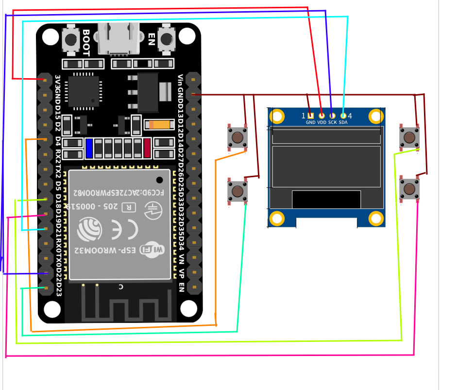

# DAY 02 - TIMER
---
>Today I am gonna make a working **timer** on [**esp32**][microcontroller] using Arduino IDE. I will use the [0.96 inch OLED display][DISPLAY] to show the timer countdown. The timer will be set for a specific duration, and it will count down to zero, displaying the remaining time on the OLED screen. I will also include buttons to start, pause, and reset the timer.

## CONNECTIONS
| ESP32 | DISPLAY |
| :------: | :------: |
| 3V3    | VCC   |
| GND   | GND   |
| D21 | SDA |
| D22 | SCK |

| ESP32 | BUTTONS |
| :---: | :-----: |
| D4 | B1 |
| D18 | B2 |
| D19 | B3 |
| D23 | B4 |

**Here is the circuit diagram**


---
Now starting the thought process:

### 1. ⏱ Time tracking

ESP32 always knows:
    **How many milliseconds have passed since it started**

Using this we track 3 things :
1. Start time = when user pressed start
2. Current time = now
3. Elapsed time = current - start

### 2. 🧠 State machine

Your timer should always be in one state:
* IDLE
* RUNNING
* PAUSED

Flowchart of workflow :
>IDLE → (press start) → RUNNING  
>RUNNING → (press start) → PAUSED  
>PAUSED → (press start) → RUNNING  
>ANY → (press reset) → IDLE


### 🔘 3. Button behaviour
* **Button 1 → Start / Pause**
```
* IF state == IDLE:
   * start timer
   *  state = RUNNING
   * save start_time
```
```
* IF state == RUNNING:
    * pause timer
    * state = PAUSED
    * store elapsed_time
```
```
* IF state == PAUSED:
    * resume timer
    * state = RUNNING
    * adjust start_time
```

* **Button 2 → Increase value**

```
IF state == IDLE:
    increase selected field
```

* restriction:
    * Only allow editing in IDLE
    * Otherwise things get messy

* **Button 3 → Change field**
    >`HOURS → MINUTES → SECONDS → HOURS (loop)`
    * This only changes `selected feild`

* **Button 4 → Reset**
    ```
    → state => IDLE
    → hours, minutes, seconds => 0
    → elapsed_time => 0
    ```

[DISPLAY]: https://robocraze.com/products/0-96in-oled-display-module-4pin?variant=40192586645657&country=IN&currency=INR&utm_medium=product_sync&utm_source=google&utm_content=sag_organic&utm_campaign=sag_organic&campaignid=22114711878&adgroupid=&keyword=&device=c&gad_source=1&gad_campaignid=22124708836&gclid=CjwKCAjw0dPRBhAPEiwAE5vTTtB2pOosa1h-hSsW4aUZJxJgzP6xB4-1iUmfsCz1IEMTIpXf7ZMTsxoC48AQAvD_BwE
[microcontroller]: https://robu.in/product/esp-wroom-32-wifi-bluetooth-networking-smart-component-development-board/?gad_source=4&gad_campaignid=17413441824&gclid=CjwKCAjw0dPRBhAPEiwAE5vTTub9dy-XCyU5TqJPH2LHzwRGlTahVgFwhWjHYHfe_U1o0G56Ze6oURoChA8QAvD_BwE